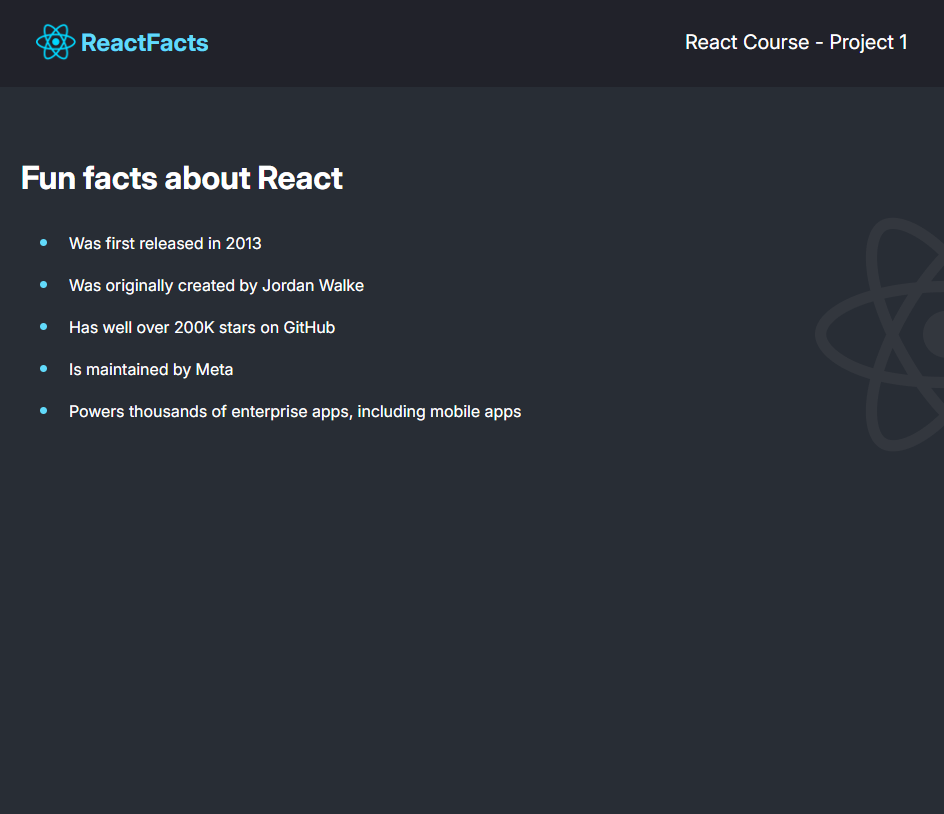

# Scrimba React Project 1

This is the first project in the [Scrimba React Learning Path](https://scrimba.com/learn/learnreact). The ask is to create a static page using the concepts learned in module 1. The concepts covered include:

* Declarative vs Imperative
* JSX
* Custom Components
* Styling with Classes
* Using Vite to run React locally

